### 📌사용자를 위한 맞춤형 트레이닝 서비스

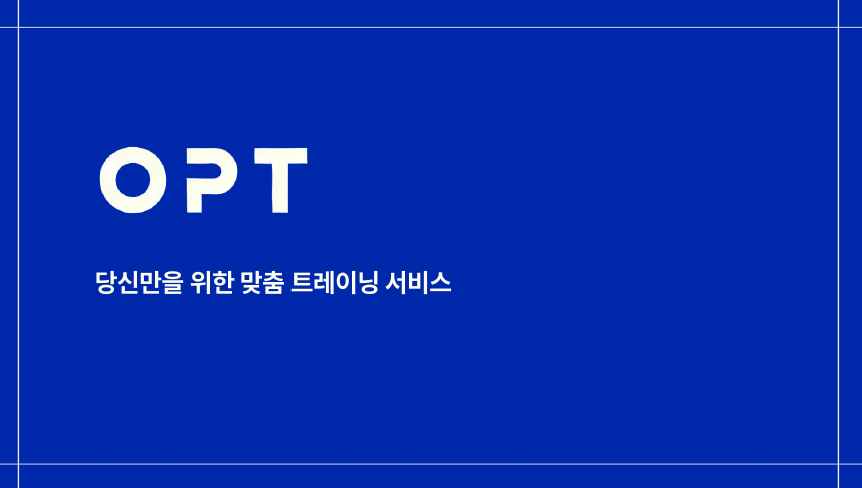
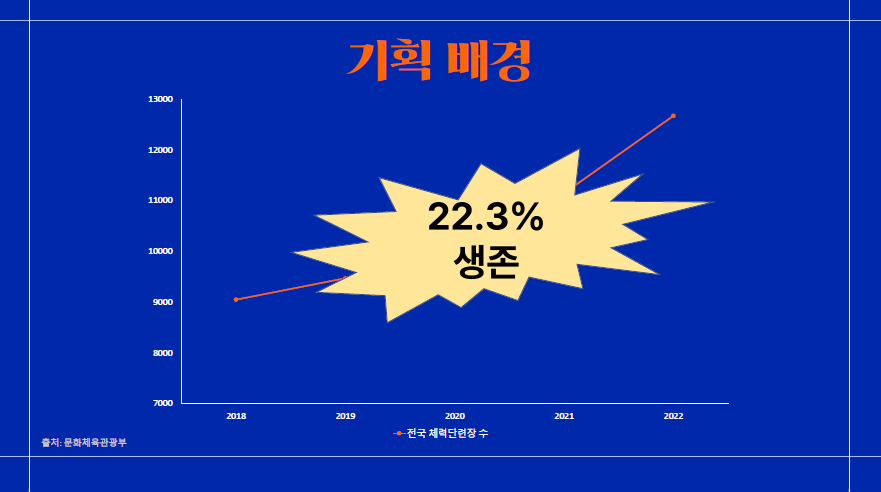
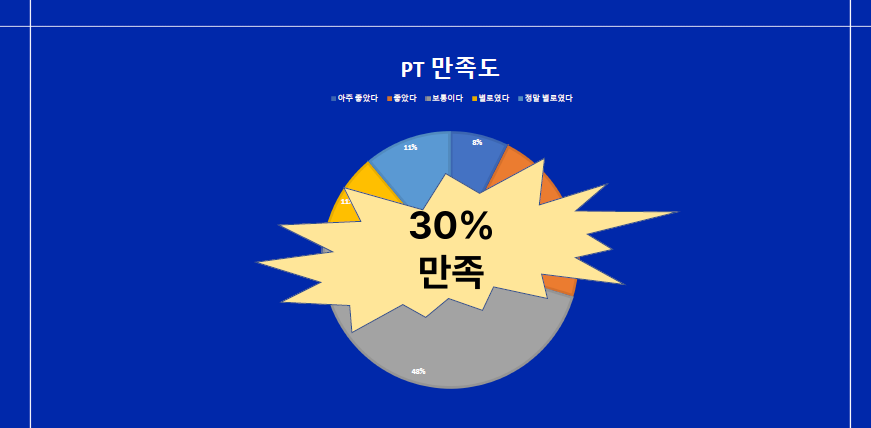
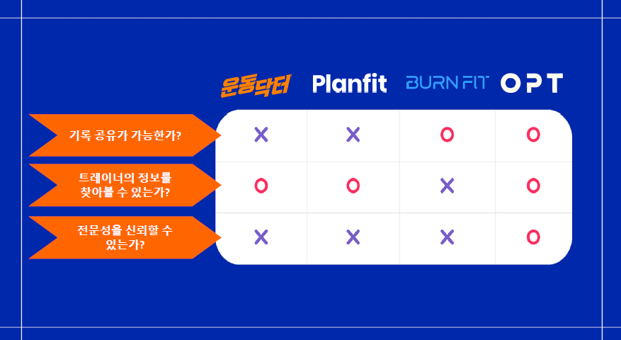
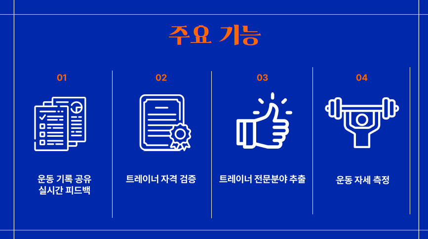
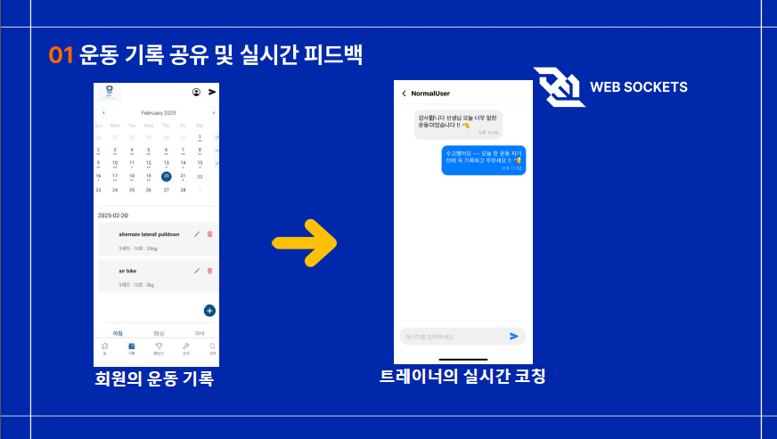
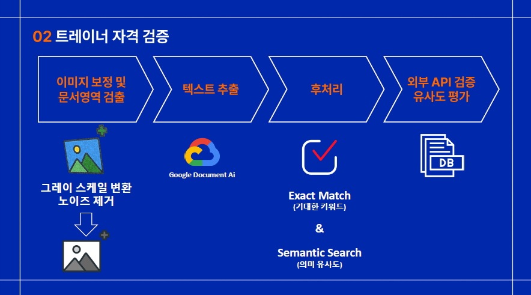
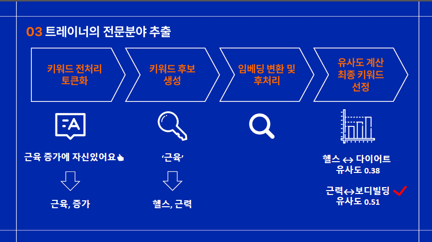
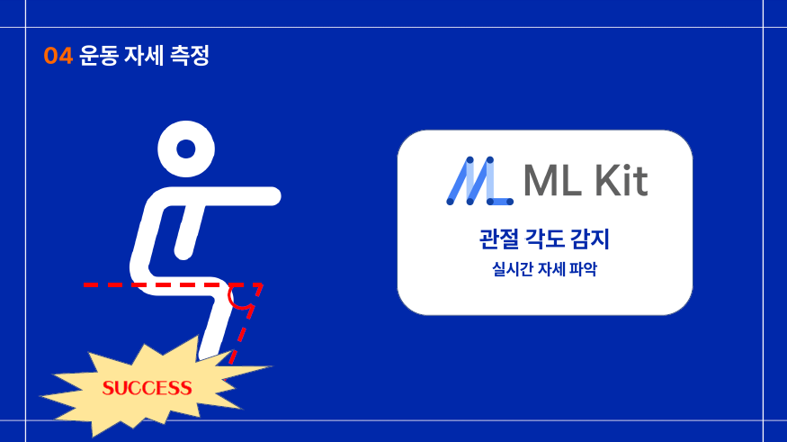
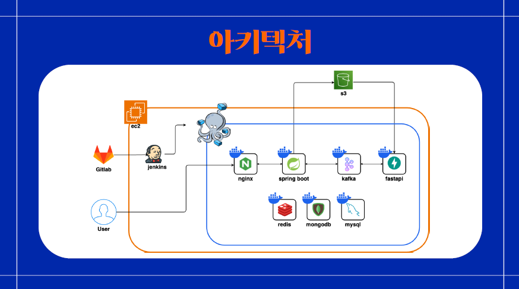
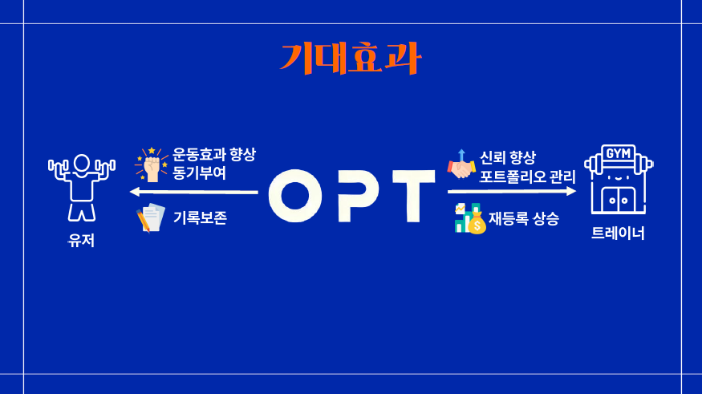

### 나의 Trouble Shooting

- Web Bundling failed 469ms index.ts (828 modules)
  Unable to resolve "../assets/images/manager-profile.png" from "screens\chat\ManagerChatScreen.tsx"

  - Screen의 폴더구조를 바꾸고 이 파일을 import하거나 상대경로로 파일을 지정해 놓았을 때 오류가 뜨는 것을 확인함, 맞춰서 수정하는 작업들이 필요.

- no overload matches this call

  - 타입지정 안해서 생기는 문제
  - 예를들면
  - type RootStackParamList = {
    LoginNeedScreen: undefined;
    DMScreen: undefined;
    // 다른 필요한 스크린들도 여기에 추가
    };
  - 이러한 코드입력으로 해결할 수 있다.

- C:\git any navigator.

  Do you have a screen named '홈'?

  If you're trying to navigate to a screen in a nested navigator, see https://reactnavigation.org/docs/nesting-navigators#navigating-to-a-screen-in-a-nested-navigator.

  If you're using conditional rendering, navigation will happen automatically and you shouldn't navigate manually.

  This is a development-only warning and won't be shown in production.

  - TopHeader에서 사용하는 네비게이션과 BottomTabNavigator에서 사용하는 스크린 이름이 다르기 때문
    BottomTabNavigator에서는 "홈"이라고 등록했지만, 이는 Tab 네비게이션의 스크린 이름이고 Stack 네비게이터에서는 이 전체 탭 네비게이터가 "Main"이라는 이름으로 등록되어 있다.
    navigation.navigate('Main', { screen: '홈' }); 라고 수정하고 type 정의를 다시 하며 진행하면 오류가 해결 됨됨

- JSX element class does not support attributes beacuse it does not have a 'props' property
  - 단순 import 문제, import 잘 확인하기
